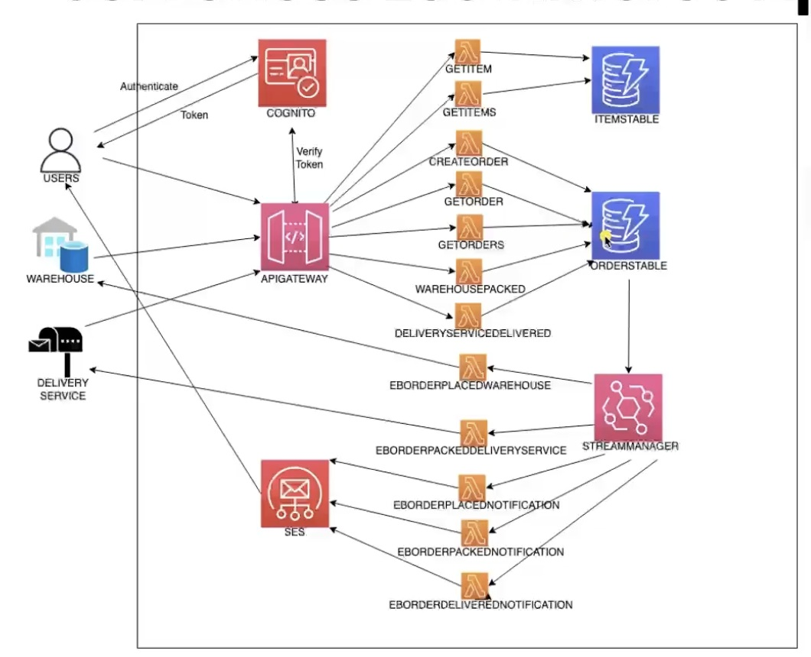

# 🛒 Serverless E-Commerce Platform

<div align="center">
  
</div>

[](https://aws.amazon.com/)
[](https://www.typescriptlang.org/)
[](https://www.serverless.com/)
[](https://aws.amazon.com/dynamodb/)
[](https://aws.amazon.com/cognito/)

A comprehensive, event-driven serverless e-commerce platform built on AWS, featuring microservices architecture, real-time order processing, and automated workflow management.

## 🌟 Features

### Core E-Commerce Functionality
- **Product Catalog Management** - Browse and search products by category, type, and brand
- **User Authentication & Authorization** - Secure user registration and login with AWS Cognito
- **Order Management** - Complete order lifecycle from placement to delivery
- **Real-time Notifications** - Email notifications for order status updates
- **Inventory Management** - Product availability and tracking

### Advanced Serverless Features
- **Event-Driven Architecture** - AWS EventBridge for decoupled microservices
- **DynamoDB Streams** - Real-time data processing and event triggering
- **Lambda Functions** - Serverless compute for all business logic
- **API Gateway** - RESTful API endpoints with CORS support
- **SES Integration** - Automated email notifications
- **Secrets Management** - Secure API key management with AWS Secrets Manager

### Order Processing Workflow
1. **Order Placement** - Customer places order through authenticated API
2. **Warehouse Notification** - Automatic notification to warehouse system
3. **Order Packing** - Warehouse marks order as packed
4. **Delivery Service** - Automatic notification to delivery service
5. **Order Delivery** - Delivery service marks order as delivered
6. **Customer Notification** - Email confirmation sent to customer

## 🏗️ Architecture

### System Overview
This e-commerce platform follows a microservices architecture pattern, where each business capability is implemented as an independent, loosely coupled service. The system uses AWS EventBridge for event-driven communication between services, ensuring scalability and maintainability.

### Technology Stack
- **Runtime**: Node.js 16.x with TypeScript
- **Framework**: Serverless Framework 3.x
- **Database**: Amazon DynamoDB with Global Secondary Indexes
- **Authentication**: AWS Cognito User Pools
- **API**: Amazon API Gateway
- **Compute**: AWS Lambda Functions
- **Events**: Amazon EventBridge
- **Email**: Amazon SES
- **Secrets**: AWS Secrets Manager
- **Infrastructure**: Infrastructure as Code with Serverless Framework

### Data Models

#### Items Table
- **Primary Key**: `id` (String)
- **GSI**: `pk` (category) + `sk` (type#brand#id)
- **Attributes**: title, company, description, storage, colorPreference

#### Orders Table
- **Primary Key**: `id` (String)
- **GSI**: `pk` (userId) + `sk` (order#timestamp)
- **Attributes**: userId, userEmail, dateCreated, status, items
- **Stream**: Enabled for real-time event processing

## 🚀 Getting Started

### Prerequisites
- Node.js 16.x or higher
- AWS CLI configured with appropriate permissions
- Serverless Framework CLI
- Git

### Installation

1. **Clone the repository**
   ```bash
   git clone https://github.com/yourusername/serverless-ecommerce-platform.git
   cd serverless-ecommerce-platform
   ```

2. **Install dependencies**
   ```bash
   npm install
   ```

3. **Configure environment variables**
   ```bash
   cp .env.example .env
   # Edit .env with your AWS credentials and configuration
   ```

4. **Deploy to AWS**
   ```bash
   npm run deploy
   ```

### Environment Variables
Create a `.env` file with the following variables:
```env
# AWS Configuration
AWS_REGION=us-east-2
AWS_PROFILE=your-profile

# API Keys for External Services
warehouseApiKey=your-warehouse-api-key
orderpackedApiKeys=your-orderpacked-api-key
orderdeliveredApiKey=your-delivery-api-key
```

## 📚 API Documentation

### Authentication Endpoints

#### POST /signup
Register a new user account.
```json
{
  "clientId": "cognito-client-id",
  "userPoolId": "cognito-user-pool-id",
  "username": "user@example.com",
  "password": "securepassword"
}
```

#### POST /signin
Authenticate user and get access token.
```json
{
  "clientId": "cognito-client-id",
  "userPoolId": "cognito-user-pool-id",
  "username": "user@example.com",
  "password": "securepassword"
}
```

### Product Endpoints

#### GET /items?category={category}&type={type}&brand={brand}
Retrieve products with optional filtering.
- `category`: phone, computer, accessories
- `type`: smart, feature, laptop, desktop
- `brand`: apple, samsung, dell, etc.

#### GET /items/{itemId}
Get specific product details.

### Order Endpoints

#### POST /orders
Create a new order (requires authentication).
```json
{
  "items": [
    {
      "id": "item-id",
      "count": 2,
      "color": "1"
    }
  ]
}
```

#### GET /order/{orderId}
Get order details (requires authentication).

#### GET /orderslist
Get user's order history (requires authentication).

### External Service Endpoints

#### POST /orderpacked/{orderId}
Mark order as packed (warehouse integration).

#### POST /orderdelivered/{orderId}
Mark order as delivered (delivery service integration).

## 🔧 Development

### Project Structure
```
├── src/
│   ├── functions/           # Lambda function implementations
│   │   ├── createOrder/     # Order creation logic
│   │   ├── getItems/        # Product catalog retrieval
│   │   ├── signUpUser/      # User registration
│   │   ├── signInUser/      # User authentication
│   │   ├── streamManager/   # DynamoDB stream processor
│   │   └── eb*             # EventBridge handlers
│   └── libs/               # Shared libraries
│       ├── APIResponses.ts # HTTP response utilities
│       ├── Dynamodb.ts     # DynamoDB operations
│       ├── cognitoToken.ts # Cognito authentication
│       └── SES.ts          # Email service
├── serverlessConfigs/      # Serverless configuration
│   ├── functions.ts        # Function definitions
│   ├── dynamodb.ts         # Database resources
│   ├── cognitoConfig.ts    # Authentication setup
│   └── secrets.ts          # Secrets management
├── seedData/              # Sample data and seeding
└── serverless.ts          # Main serverless configuration
```

### Local Development
```bash
# Install dependencies
npm install

# Run locally with serverless offline
npm run dev

# Deploy to development
npm run deploy:dev

# Deploy to production
npm run deploy:prod
```

### Testing
```bash
# Run unit tests
npm test

# Run integration tests
npm run test:integration

# Run all tests
npm run test:all
```

## 🔒 Security

### Authentication & Authorization
- AWS Cognito User Pools for user management
- JWT tokens for API authentication
- IAM roles with least privilege principle
- API Gateway authorizers for protected endpoints

### Data Protection
- All data encrypted at rest in DynamoDB
- Secrets stored in AWS Secrets Manager
- Environment variables for sensitive configuration
- CORS properly configured for web applications

### API Security
- Input validation on all endpoints
- Rate limiting through API Gateway
- HTTPS only communication
- Proper error handling without information leakage

## 📊 Monitoring & Observability

### CloudWatch Integration
- Lambda function logs and metrics
- DynamoDB performance metrics
- API Gateway request/response logging
- Custom CloudWatch alarms for critical operations

### Error Handling
- Comprehensive error logging
- Dead letter queues for failed events
- Retry mechanisms for transient failures
- User-friendly error messages

## 🚀 Deployment

### Environments
- **Development**: `dev` stage for testing and development
- **Production**: `prod` stage for live application

### Deployment Commands
```bash
# Deploy to development
npx sls deploy --stage dev

# Deploy to production
npx sls deploy --stage prod

# Deploy specific function
npx sls deploy function --function functionName

# Remove entire stack
npx sls remove --stage dev
```

### CI/CD Pipeline
The project includes GitHub Actions workflows for:
- Automated testing on pull requests
- Deployment to development environment
- Production deployment with approval gates
- Security scanning and dependency updates

## 📈 Performance & Scalability

### Auto-scaling
- Lambda functions scale automatically based on demand
- DynamoDB on-demand billing for variable workloads
- API Gateway handles traffic spikes automatically

### Optimization
- Lambda function optimization for cold starts
- DynamoDB query optimization with GSI
- EventBridge for asynchronous processing
- Connection pooling for database operations
